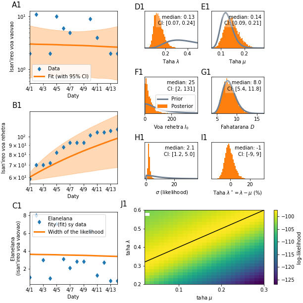
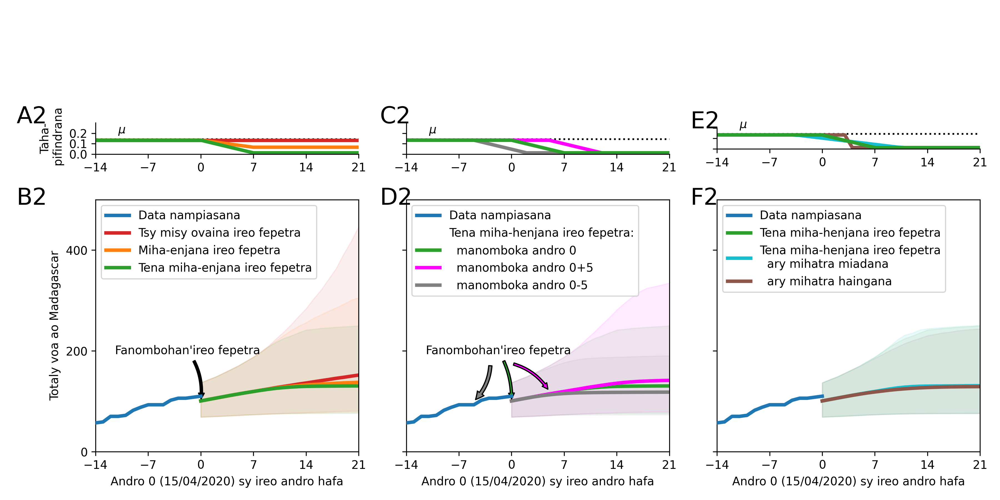

# Fanombanana sy Covid-19 araky ny modely Priesemann et al.

<!---->

Fanadihadina vokatry ny fifandraisan'ny olona maromaro tsy ho voatanisa avokoa. Marihana manokana ny namana iray avy ao @ Centre de Commandement Operationnel (CCO) Covid-19 Madagasikara, mpikaroka malagasy iray nanadihady ny mety ho fivoaran'ny isan'ireo nifindran'ny Covid-19 ao Madagasikara, mpinamana niara-namadika ny fikarohan'ilay ekipa alemana (Priesemann et al) hifanaraka amin’ireo antontan'isa ao Madagasikara, ary rahalahy ao amin'ny Fikambanan'i Jesoa.

Ilay modely-programa [eto](https://github.com/Priesemann-Group/covid19_inference_forecast/blob/master/scripts/paper/Corona_germany_simple_model.ipynb) nampiasan-dry Priesemann et al no ovaina sy ampifanarahana amin'ireo antontan'isa momba an'i Madagasikara. [is available on arXiv](https://arxiv.org/abs/2004.01105).

### Jereo eto ny momba ny tetik'asa ankapobeany [disclaimer](disclaimer.md).

Toy izao ireo vokatra avy amin'ilay modely [nampifanarahana](https://github.com/herysedra/covid19-mankaiza-clone/blob/andrana/scripts/paper/Covmdg_andrana.ipynb).

### Vokatra an-tsary

