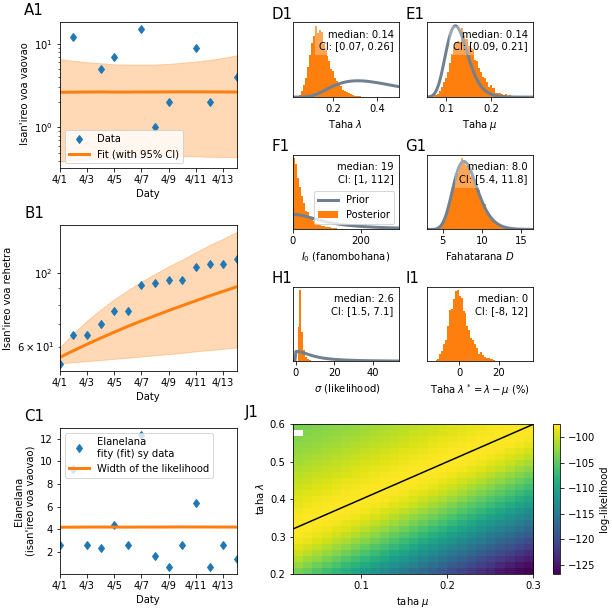
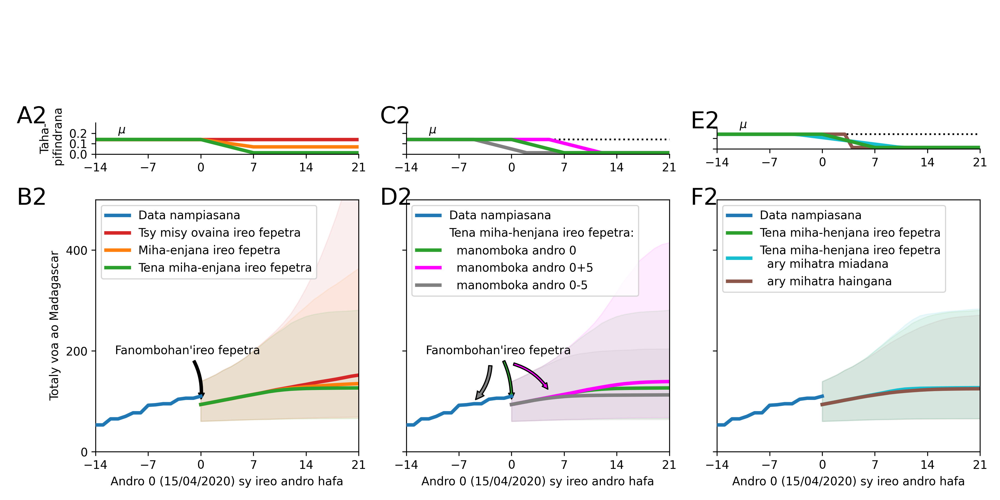

# Fanombanana andrana

<!--

-->

<!-- Fanadihadina vokatry ny fifandraisan'ny olona maromaro tsy ho voatanisa avokoa. Marihana manokana ny namana avy ao @ Centre de Commandement Operationnel (CCO) Covid-19 Madagasikara, ny mpikaroka malagasy manadihady ny mety ho fivoaran'ny isan'ireo nifindran'ny Covid-19 ao Madagasikara, ny namana miara-namadika ny fikarohan'ilay ekipa alemana (Priesemann et al) hifanaraka amin’ireo antontan'isa ao Madagasikara,ireo namana sy fianakaviana ary ireo rahalahy ao amin'ny Fikambanan'i Jesoa. -->

Ilay modely-programa [eto](https://github.com/Priesemann-Group/covid19_inference_forecast/blob/master/scripts/paper/Corona_germany_simple_model.ipynb) nampiasan-dry Priesemann et al no ovaina sy ampifanarahana amin'ireo antontan'isa momba an'i Madagasikara.

### Jereo [eto](momba_ny_tetikasa.md) ny momba ny tetik'asa ankapobeny.

Toy izao ireo vokatra avy amin'ilay [modely nampifanarahana](https://github.com/herysedra/covid19-mankaiza-clone/blob/andrana/scripts/paper/Covmdg_andrana.ipynb).

### Vokatra an-tsary N = 2,000,000 avy @ CCO data.

<!-- 
Andrana. We want to quantify the effect of new policies on the spread of COVID-19. Crucially, fitting an exponential function to the number of cases lacks an interpretability of the fitting error. We built a Bayesian SIR model where we can incorporate our prior knowledge of the time points of governmental policy changes. At the example of Germany, we show that the two kinks in the last weeks correspond to two changes of policies, leading to a growth rate of about 0 now.
-->
<!-- The research article [is available on arXiv](https://arxiv.org/abs/2004.01105). -->

<!-- The code used to produce the figures is available [here](https://github.com/Priesemann-Group/covid19_inference_forecast/blob/master/scripts/paper/Corona_germany_simple_model.ipynb) (simple model) and [here](https://github.com/Priesemann-Group/covid19_inference_forecast/blob/master/scripts/paper/SIR_with_delay_Germany_3scenarios.ipynb) (with change points).
It is runnable in Google Colab. Requirement is PyMC3 >= 3.7. -->

<!-- If you want to use the code, we recommend to look at our [documentation](https://covid19-inference-forecast.readthedocs.io/en/latest/).

<!-- Some output figures are shown below. The rest are found in the figures folder. We update them regularly.

<!-- ### Please take notice of our [disclaimer](disclaimer.md).

<!-- ## What-if scenarios

<!-- What if the growth would have continued with less change points?

<!-- 

<!-- We fitted the four scenarios to the number of new cases until respectively March 18th, March 25th, April 1st and April 7th.

<!-- ## Modeling three different scenarios in Germany (updated figures of the paper)

<!-- ### Summary

<!-- 

<!-- ### Scenario assuming three change points

<!--

  
   

<!-- ### Scenario assuming two change points

<!-- 

  
  

<!-- ### Scenario assuming one change point

  
  

